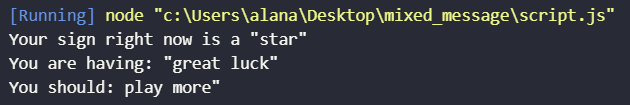

# Simple Mixed Message

 Este projeto é uma desafio da [CodeAcademy](https://www.codecademy.com) e o propósito é a criação de um **gerador de mensagem** simples usando o controle de versão do Git e o GitHub para hospedar

## Objetivos do projeto:

* Criar um programa gerador de mensagens usando JavaScript
* Usar o controle de versão do Git
* Usar linha de comando
* Desenvolver localmente no computador

 ## Como usar

O usuário deve executar o programa localmente e receberá uma mensagem aleátoria

## Tecnologias utilizadas

> JavaScript

> Git e GitHub